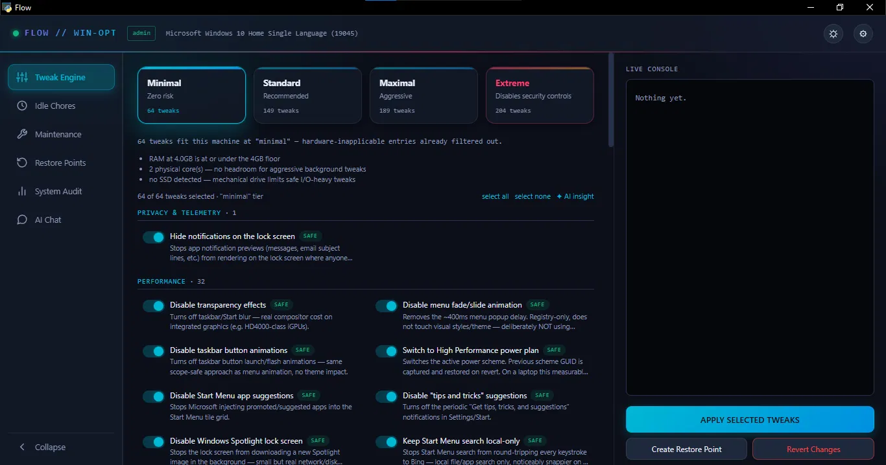
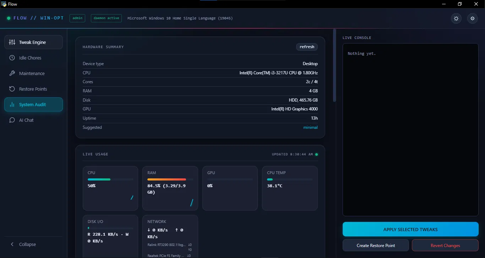

# Flow

A Windows system optimization tool that fingerprints your actual hardware first, then only shows tweaks that fit it — instead of dumping 300 generic checkboxes on you and hoping you know which ones are safe on a 4GB laptop from 2013.

Built and tested on genuinely low-spec hardware (Intel i3, 4GB RAM, mechanical HDD, Windows 10 Home) — if it runs well there, it runs well anywhere.


## Why Flow

Existing Windows debloat/tweak tools (WinUtil, hellzerg/optimizer, and similar) hand you a big flat list and expect you to know what's safe on your machine. Flow detects your CPU, RAM, disk type, GPU, and OS build first, then filters the tweak list automatically — an HDD-only tweak never shows up on an SSD rig, a laptop-only power tweak never shows up on a desktop.

- **202 tweaks**, individually researched and OS-gated (Win7 through Win11), every registry key traced to a real source — nothing invented to pad a number
- **Hardware-aware filtering** — tweaks are hidden, not just greyed out, if they don't apply to your disk type, RAM, GPU, or form factor
- **4 tiers**: Minimal (zero risk) → Standard (recommended) → Maximal (aggressive) → Extreme (disables real security controls, never auto-suggested)
- **Mandatory restore point** before any apply — no opt-out, no exceptions
- **Full revert tracking** — every tweak's previous value is captured before it's touched, not assumed
- **Idle-time daemon** — optionally re-checks applied tweaks in the background and reapplies anything that silently drifted (Windows Update reset a service, etc.)
- **Optional AI advisor** — plain-language explanation of why each tweak fits *your* specific hardware (Groq/Gemini free tier, or bring your own OpenAI/Anthropic/OpenRouter key), with an offline fallback mode for hardware/tier/tweak lookups when no key is configured
- **Zero required dependencies** beyond the standard library for every code path except the GUI shell itself

## Screenshots




## Install & Run

**Requirements:** Windows 10 or 11, Python 3.9+.

```powershell
git clone https://github.com/Anish-132/Flow-Win-Opt.git
cd Flow-Win-Opt
```

Easiest path — just double-click `flow.bat`. It self-elevates (UAC prompt), finds your Python install, and launches the GUI. No manual pip install needed — Flow vendors `pywebview` into a local `_flow_deps/` folder on first run if it isn't already installed, so nothing touches your system-wide Python packages.

Manual path:
```powershell
pip install -r requirements.txt
python flow.py gui
```

Run as **Administrator** — registry/service tweaks silently no-op without elevation (Flow tells you this in the GUI banner rather than failing quietly).

### One-line install (optional)

```powershell
irm https://raw.githubusercontent.com/Anish-132/Flow-Win-Opt/main/bootstrap.ps1 | iex
```

Downloads Flow to a temp folder, runs it, and deletes the folder when you close the window. See [`bootstrap.ps1`](bootstrap.ps1) for exactly what it does — worth reading before piping anything to `iex`, including this.

## How tier selection works

Flow fingerprints your hardware once (CPU cores, RAM, disk type, GPU, form factor) and suggests a starting tier based on real thresholds — a 4GB/2-core/HDD machine is steered to Minimal, a 16GB+/6-core+/SSD+dGPU machine to Maximal. You can always override and pick any tier manually; the suggestion is a starting point, not a lock.

Every tweak also declares its own hardware gate independently of tier (`hdd_only`, `ssd_only`, `laptop_only`, `dgpu_present`, etc.), so switching tiers on the wrong hardware never surfaces a tweak that would actively hurt that machine.

## Command line

```
python flow.py detect                  # print hardware profile as JSON
python flow.py list-tweaks [tier]       # list tweaks that fit this machine
python flow.py apply-tier <tier>        # apply a whole tier
python flow.py revert-all               # revert everything Flow has applied
python flow.py daemon-install [minutes] # install the background drift-check daemon
python flow.py check-requirements       # verify/auto-fix Python/pip/WebView2/pywebview
python flow.py gui                      # launch the GUI (same as flow.bat)
```

Full subcommand list: `python flow.py --help` (or see the bottom of `flow.py`).

## AI advisor (optional)

Copy `.env.example` to `.env` and fill in one API key, or paste one directly in the GUI's Settings panel (gear icon). Groq and Gemini both have genuinely free tiers with no card required. The AI **never chooses which tweaks apply** — `TWEAK_DATABASE` and the hardware filter are the only things that decide that. All the AI does is narrate, in plain language, why a tweak matters for your specific detected hardware, and flag anything worth double-checking.

No key configured → the AI Chat tab drops to an offline fallback (hardware specs, suggested tier, keyword search over the current tier's tweaks) instead of disabling entirely. Full free-form reasoning still needs a key.

## Safety model

- A System Restore checkpoint is created automatically before any tweak batch — if it can't be created, the apply is refused outright, not applied anyway
- Every tweak's previous state is captured and logged before it's touched; `revert-all` restores exactly that captured state, never an assumed default
- The **Extreme** tier (disables UAC, firewall, Defender, etc.) is never auto-suggested and requires explicitly selecting it
- Tweaks that can't be cleanly reverted (uninstalled apps, removed Edge) say so plainly in their description — Flow doesn't pretend everything is reversible

## Contributing

See [CONTRIBUTING.md](CONTRIBUTING.md). Short version: every registry key needs a real, checkable source — no invented tweaks, no "seems right" values.

## License

MIT — see [LICENSE](LICENSE).